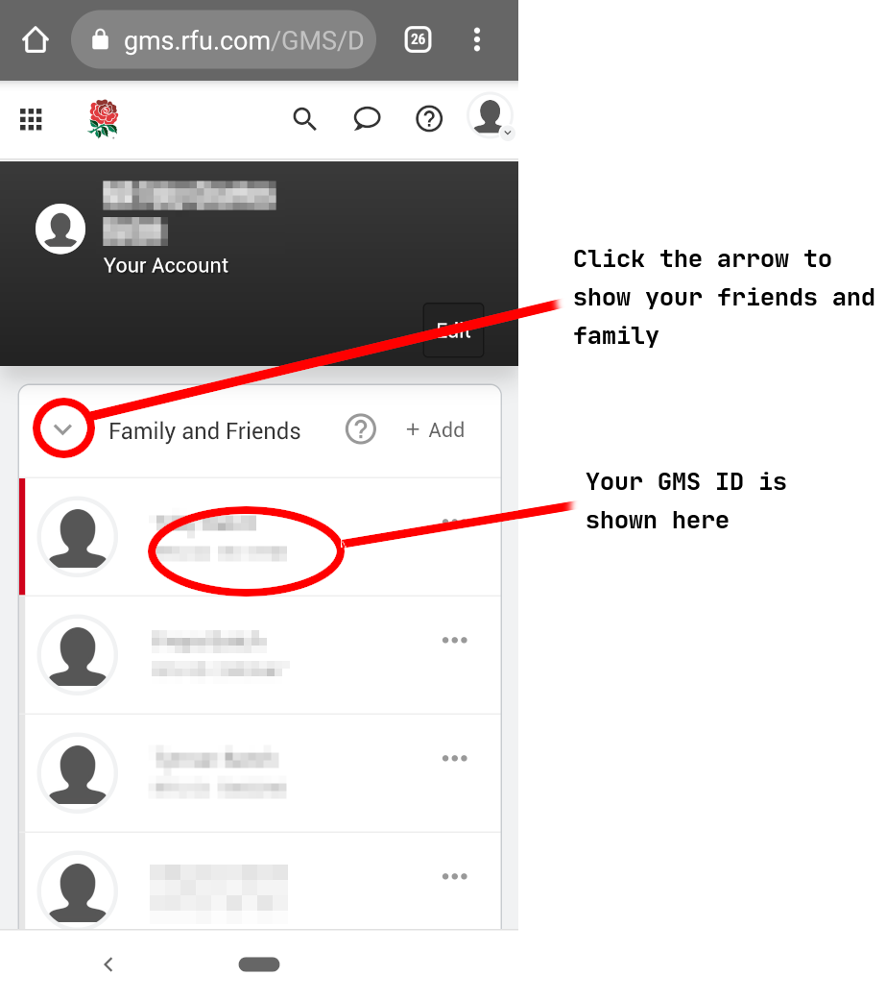

## Volunteering

### Roles
 
 * [Coaches](roles/coaches.md)
 * [First Aiders](roles/firstaider.md)
 * [Team Managers](roles/managers.md)
 * [Fixture Secretary](roles/fixtures-sec.md)
 * [Youth/Minis DOR](roles/mini-youth-dor.md)
 * [Safeguarding Officers](roles/so.md)

### GMS ID

If you are going to volunteer with NRFC then you will need to complete a disclosure and barring service check(DBS).  The RFU requires you to complete a check with them and does not accept DBS checks from other organisations.  To start one of these checks just contact the safeguarding team with you name and GMS RFU id number. You can find that number on your dashboard https://gms.rfu.com/GMS/Dashboard/Individual.

If you do not have a GMS account then you will need to create one before we can ask the RFU to start the check.  This may happen if you are not a registered player or did not register your child yourself.

### Doing the DBS Check

Once the check has been initiated you'll receive an email from the RFU, just follow the instructions in the email.  You will need to find three documents that identify you, the simplest for most people are your passport, driving license and a utility bill but the full list can be found on the government DBS site: https://www.gov.uk/guidance/documents-the-applicant-must-provide

You will need to meet up with one of the team to check your documents, just contact us and we'll arrange a time, tobias@neontribe.co.uk.
